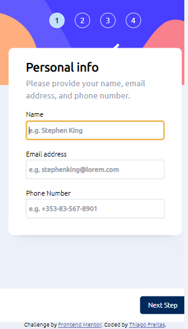
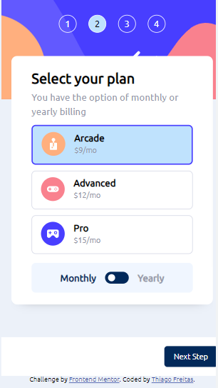
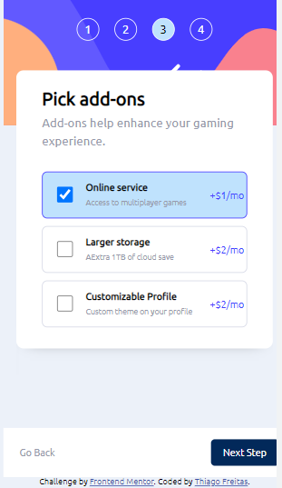
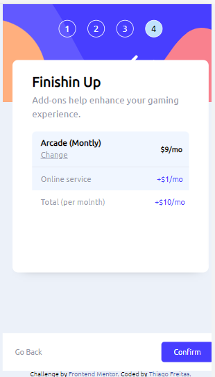
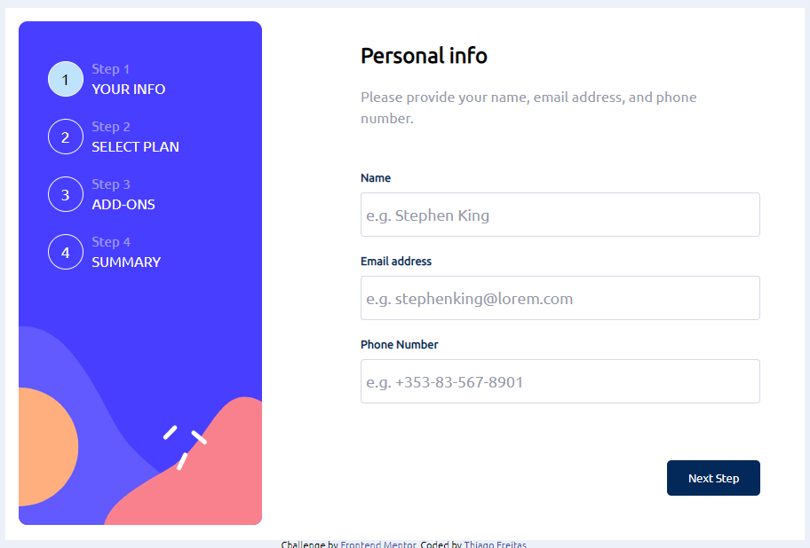
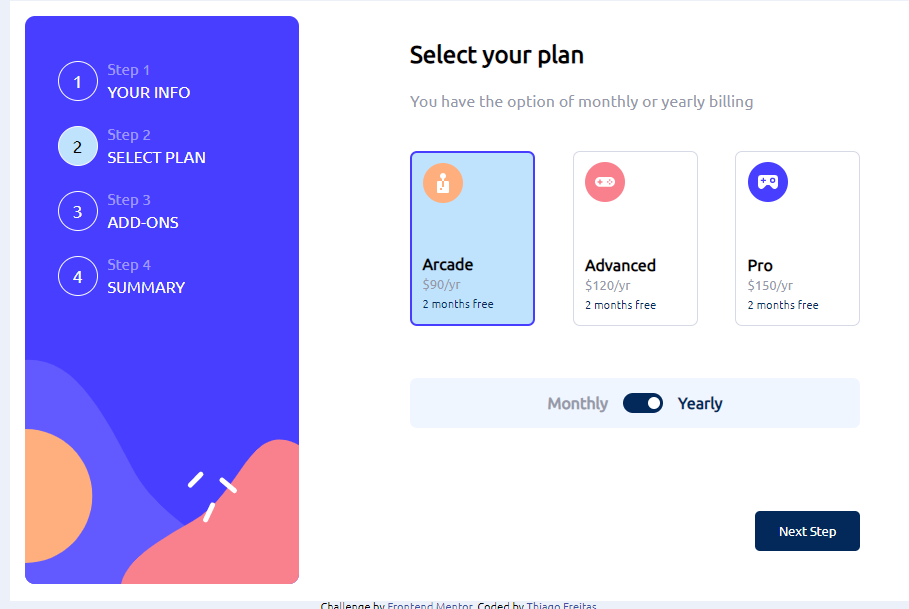
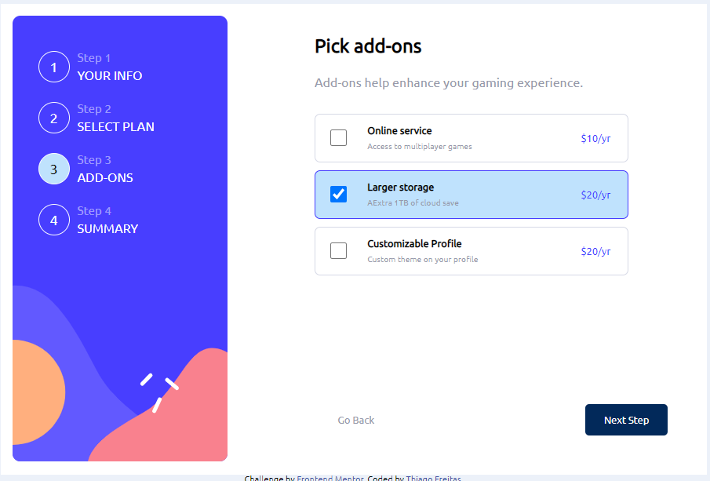
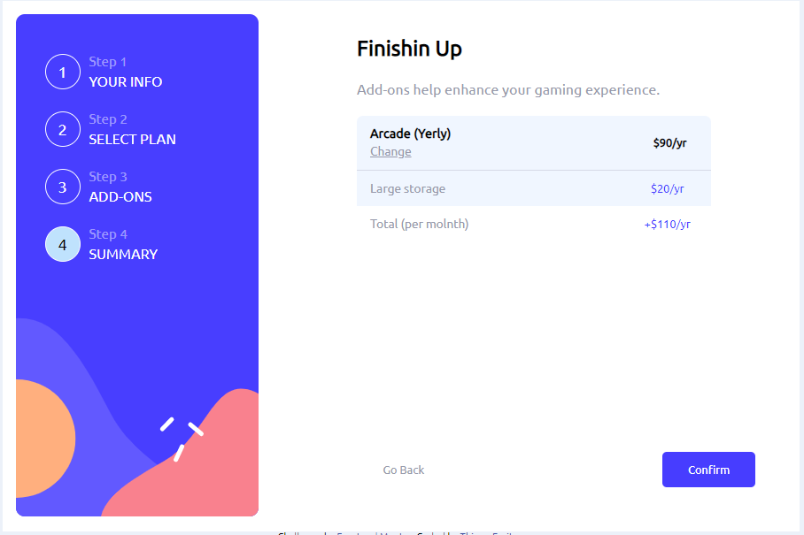
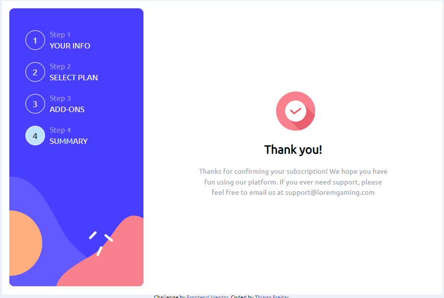

# Frontend Mentor - Multi-step form solution

This is a solution to the [Multi-step form challenge on Frontend Mentor](https://www.frontendmentor.io/challenges/multistep-form-YVAnSdqQBJ). This React App is buid using [React](https://react.dev/) and [TypeScrpt](https://www.typescriptlang.org/docs/handbook/intro.html). <spam style="font-weight: bold"> React</spam> (also known as React.js or ReactJS) is an open source frontend JavaScript library that is used for building UIs, especially for single- page and mobile apps which is based on composable components
and it only re-renders specific parts of the application wherever the screen updates are required . It is used for handling the view layer of
web and mobile apps.<spam style="font-weight: bold"> Typescript</spam> open-source programming language. It's a Javascript superset (typescript extends javascript) with the addition of static typing. serves as a superset of JavaScript, offering optional static type-checking along with the latest ECMAScript features. By incorporating types into your JavaScript code, TypeScript allows you to catch errors more effectively and write more maintainable and robust code, perfect for large-scale projects.
 
This project has three different variations. It was initialy build usising [JS Modules](https://github.com/ThiagoAndo/multi-step-form-main), [ReactJS](https://github.com/ThiagoAndo/React-mult-step-form) and this one;

## Built with

- ReactJS
- Typescript
- createContext
- useReducer
- Flexbox
- CSS Grid
- Mobile-first workflow

## Getting Started

In order to run the project from a container we need `node>=14` and `npm>=7` installed on our development machines.
### Instructions
- Fork this repository
- Clone your forked repository
- CD into the project folder
- Run the commands `npm instal` to instal all dependencies required in the project and `npm run dev` to start the development server

## Table of contents

- [Overview](#overview)
  - [The challenge](#the-challenge)
  - [Screenshot](#screenshot)
  - [Code](#code)
  - [Links](#links)
- [My process](#my-process)
  - [Built with](#built-with)
  - [What I learned](#what-i-learned)
  - [Continued development](#continued-development)
- [Author](#author)
- [Acknowledgments](#acknowledgments)

**Note: Delete this note and update the table of contents based on what sections you keep.**

## Overview

### The challenge

Users should be able to:

- Complete each step of the sequence
- Go back to a previous step to update their selections
- See a summary of their selections on the final step and confirm their order
- View the optimal layout for the interface depending on their device's screen size
- See hover and focus states for all interactive elements on the page
- Receive form validation messages if:
  - A field has been missed
  - The email address is not formatted correctly
  - A step is submitted, but no selection has been made
### Screenshot

 

#### Mobile

 

    

 

    

 

    

 

    

 
 

#### Desktop

 

    

 

    

 

    

 

    

    

 

### Links

- Solution URL: [Solution Frontend Mentor](https://www.frontendmentor.io/solutions/mobilefirst-html5-css-js-wR9hS7nsf2)
- Live Site URL: [live site](https://resilient-creponne-e85869.netlify.app)

## My process

### What I learned

    I chose the Multi-step form challenge because it seemed to have a reasonable demand for coding. I love coding! By completing this great challenge, I got to learn how to test the functionalities of the web page to prevent bugs and make sure that everything works as it is supposed to. I have decided to change the original workflow to provide the user with a better experience. First of all, Once the user writes their data and presses the Next Step button, the page will store the user data and options in the local storage in the browser. Second of all, I let a plan already chosen as a basic plan (Arcade/mo). Finally, If the user does not choose an Add service, the page will ask them if they are sure of passing the advantage of acquiring a service.

### Continued development

It is well known that working with dates and strings is not a simple task. It demands the good expertise of the programmer. It is much simpler to perform form validation using the functionalities of HTML 5 (required). However, programming a form validation using a programming language gives more control over what is required from the user. By having to identify the characters typed by the user, I realize the necessity to increase my knowledge of understading regular expressions better. The next step is to get a better grasp of it.

## Author

- Github - [Thiago Ando de Freitas](https://github.com/ThiagoAndo)
- Frontend Mentor - [@ThiagoAndo](https://www.frontendmentor.io/profile/ThiagoAndo)
- Alive Website - [multi-step-form-main](https://thiagoando.github.io/multi-step-form-main/)
